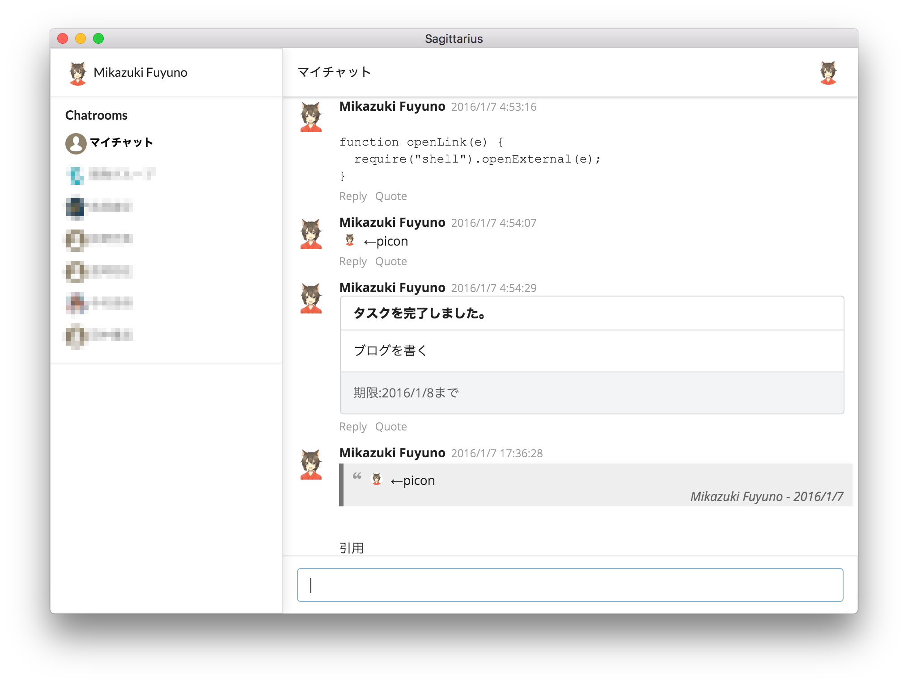

Sagittarius
----

ChatWork Client for Desktop.  
Available on OS X, Linux and Windows.

 
### ScreenShot

### Features

* Chat(View, Send)
* Desktop Notification
* Some languages(Japanese and English)